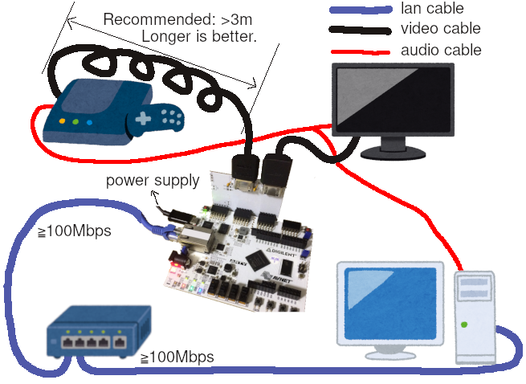

# arty-videocap
This is a video capture/repeater implementation on Arty-A7 the FPGA board.  
An extender board adds In/Out video ports which enables passthrough capability so that there is no delay from video source to monitor.
Captured video is sent as Motion JPEG (MJPEG) format over udp just like common cameras do.  

Right: No delay video from a game console  
Left: Video received in PC  

### RTL
hdl/MJPG_ENCODER.v and hdl/COMPONENT_ENCODER.v represent realtime MJPEG encoder.  
There is an equivalent implementation in C [here](https://github.com/ikanoano/bmp2jpeg).

### Extender board
Schematic and pcb layout are in pcb/

## How to use
### Hardware setup
1. Connect Arty, Video source, monitor and PC like below imege
2. Turn Arty and video source on
3. Once LD0, LD1 and LD2 grow, Arty starts repeating video signal to your monitor
4. Turn toggle switch SW0 on
5. Arty starts sending captured video as MJPEG stream to your PC
6. Receive MJPEG in PC using ffplay.  
`$ ffplay -f mjpeg -framerate 30 -i udp://127.0.0.1:4096`

images:[いらすとや](https://www.irasutoya.com/)

Confirmed Arty could repeat/capture 720p video sent from nintendo switch.

Your ethernet LAN hub should support jumbo frame, or jumbo frame must be disabled in RTL.  
Maybe reverting [this commit](https://github.com/ikanoano/ArtyEtherentTX/commit/a2c306d0d0775d83d8b783aa43c7d5825ad52278) works.

## How to build
### Extender board
1. Open pcb/pass_through/pass_through.pro with [kicad](http://kicad-pcb.org/)
2. Produce garbar files to order it to manufacturer. Thinner(≦0.8mm) board is better
3. Solder JP1-4, J1-2, F1-2, C1-2, C5-8, R9-18, JB1 and JC1
4. Attatch the extender board to Arty-A7 JB and JC

### RTL/Arty
1. [Install Vivado and Digilent Board Files.](https://reference.digilentinc.com/vivado/installing-vivado/start)
2. Create an RTL project. Target board should be Arty A35T
3. Import files under hdl/synth_capture/
4. [Edit destination IP address and MAC address here](https://github.com/ikanoano/ArtyEtherentTX/blob/4adc945a84c8c2099e27458f0dac0a361e1121d6/hdl/ethernet_test.vhd#L125)
5. Manually create 3 clocking modules using cloking wizard in vivado. See PASS_THROUGH.v
6. Generate bitfile
7. [Programming Arty using Quad SPI](https://reference.digilentinc.com/learn/programmable-logic/tutorials/arty-programming-guide/start?redirect=1#programming_the_arty_using_quad_spi)

## How to test MJPEG encoder RTL
Required: iverilog
1. Checkout [framehex branch at bmp2jpeg repo](https://github.com/ikanoano/bmp2jpeg/tree/output_framehex) and produce an executable
2. Convert any (small) image using 1. and you will get a simulated video signal in /tmp/frame.hex
3. Run make in hdl/
3. Run ./isim and you will get /tmp/frame.jpg, which is output from simulation. Check if it's valid

See how output jpeg will change if you reduce the value of DCT_TH_Y and DCT_TH_C in hdl/MJPG_ENCODER.v .

## License
### Except vivado-library/ and ArtyEtherentTX/
Copyright (c) 2018 ikanoano  
Released under the [MIT](https://opensource.org/licenses/mit-license.php) license

### vivado-library
Copyright (c) 2017 Digilent  
Released under the [MIT](https://opensource.org/licenses/mit-license.php) license  
See hdl/vivado-library/License.txt

## References
* [LucidScience - Build the VGA VIDEO GENERATOR](http://www.lucidscience.com/pro-vga%20video%20generator-1.aspx)
* [Xilinx - XAPP495 Implementing a TMDS Video Interface in the Spartan-6 FPGA](https://www.xilinx.com/support/documentation/application_notes/xapp495_S6TMDS_Video_Interface.pdf)
* [HDMI-NAVI.com - TMDS(Transition Minimized Differential Signaling)](http://www.hdmi-navi.com/tmds/)
* [bmp2jpeg](https://github.com/ikanoano/bmp2jpeg)
