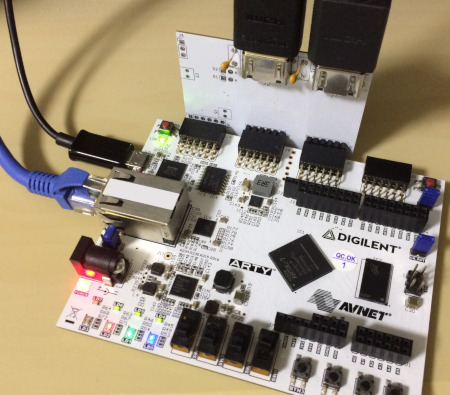
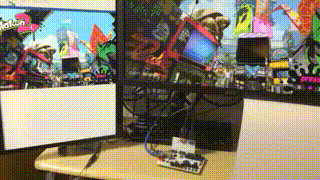

# arty-videocap
Repeat and capture the video signal with Digilent Arty-A7 and a video extender board.




Schematic and pcb layout of the video extender are in pcb/  
HDLs are in hdl/  
Reference of jpeg encoder written in hdl/COMPONENT_ENCODER.v is [here](https://github.com/ikanoano/bmp2jpeg).

多分これが一番安いキャプチャーボードだと思います

## How to use
### Hardware setup
1. Setup board and video cables like below imege.
2. Turn on arty and the video source.
3. When 3LEDs LD0, LD1 and LD2 grow, arty starts repeating the video signal to your monitor.
4. Turn on toggle switch SW0 and arty starts sending video as MJPEG stream to your PC over udp.

(great image here)

I confirmed arty can repeat and capture 720p video signal comes from nintendo switch.

### Receiving the MJPEG video
You can check receiving video using following command.
Require: ffmpeg
```
$ ffplay -f mjpeg -framerate 30 -i udp://127.0.0.1:4096
```

Confirmed with ffmpeg n4.0.2 on Linux.

## How to setup arty
### Video extender
1. Open pcb/pass_through/pass_through.pro with [kicad](http://kicad-pcb.org/).
2. Produce garbar files and send it to manufacturer. Thinner(0.6mm) PCB is better.
3. Solder JP1-4, J1-2, F1-2, C1-2, C5-8, R9-18, JB1, JC1
4. Attatch the video extender to Arty-A7 JB and JC.

### FPGA design
1. [Install Vivado and Digilent Board Files.](https://reference.digilentinc.com/vivado/installing-vivado/start)
2. Create RTL project. Target is Arty A35T board.
3. Import files under hdl/synth_capture/
4. Change destination IP and MAC addr in ethernet_test.vhd
5. Manually create 3 clocking modules using cloking wizard in vivado. See PASS_THROUGH.v .
6. Generate bitfile
7. [Programming the Arty using Quad SPI](https://reference.digilentinc.com/learn/programmable-logic/tutorials/arty-programming-guide/start?redirect=1#programming_the_arty_using_quad_spi)

## How to run testbench for MJPEG encoder
Require: iverilog
1. Checkout [framehex branch of bmp2jpeg](https://github.com/ikanoano/bmp2jpeg/tree/output_framehex) and produce an executable.
2. Convert any (small) image using 1. and you will get a simulated video signal in /tmp/frame.hex .
3. Run make in hdl/
3. Run ./isim and you will get /tmp/frame.jpg, which is output from simulation.

Try to reduce DCT_TH_Y and DCT_TH_C in hdl/MJPG_ENCODER.v and see how output jpeg will change.

## License
### Except vivado-library/ and ArtyEtherentTX/
Copyright (c) 2018 ikanoano  
Released under the [MIT](https://opensource.org/licenses/mit-license.php) license

### vivado-library
Copyright (c) 2017 Digilent  
Released under the [MIT](https://opensource.org/licenses/mit-license.php) license  
See hdl/vivado-library/License.txt

## References
[LucidScience - Build the VGA VIDEO GENERATOR](http://www.lucidscience.com/pro-vga%20video%20generator-1.aspx)  
[Xilinx - XAPP495 Implementing a TMDS Video Interface in the Spartan-6 FPGA](https://www.xilinx.com/support/documentation/application_notes/xapp495_S6TMDS_Video_Interface.pdf)  
[HDMI-NAVI.com - TMDS(Transition Minimized Differential Signaling)](http://www.hdmi-navi.com/tmds/)  
[bmp2jpeg](https://github.com/ikanoano/bmp2jpeg)  

